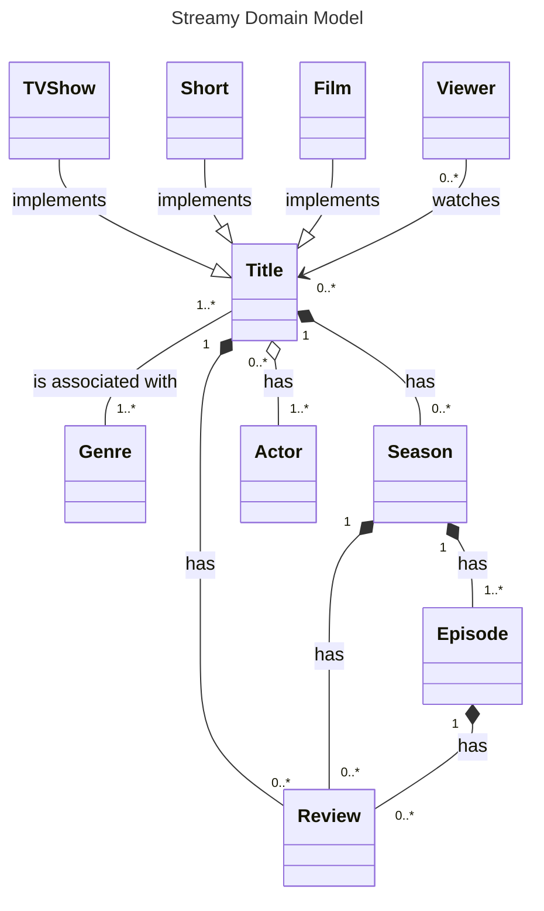
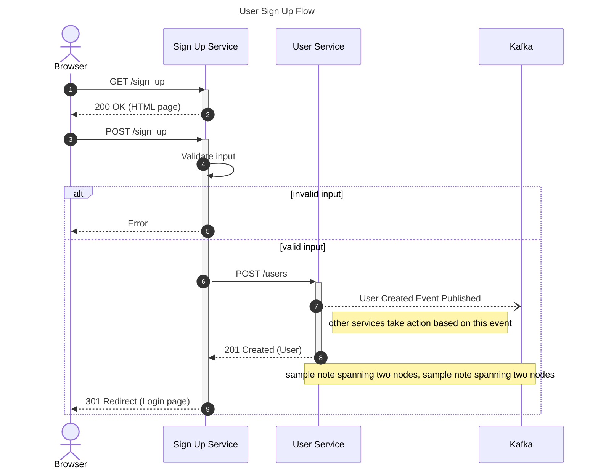

> "Make copies, young man, many copies. You can only become a good artist by copying the masters." — Jean-Auguste-Dominique Ingres

> "It's not aping or slavish emulation to immerse ourselves in the works of the masters to the point of copying them line-for-line. The masters did it themselves, studying earlier masters." — Steven Pressfield

--------

I have been studying system design and figured that one of the more essential activities in system design is creating diagrams.

Creating diagrams reminds me of UML. I tried to learn UML a decade ago, but because I have not put into constant use what I learned, it has faded into oblivion.*

But now that I have the need to create diagrams, I have to relearn UML. Along with it, I need to familiarize myself with this newer diagramming approach called [The C4 Model](https://c4model.com/) which I encountered while exploring the GitHub repository ["Modular Monolith with DDD"](https://github.com/kgrzybek/modular-monolith-with-ddd). 

Based on my own experience and the experiences of others, a good thing to do when learning something is to copy the masters. So that's what I will do with regards to diagramming --- imitate the C4 and UML diagrams made by the masters. I'll be posting in this blog the resulting works.

--------

#### 1. System Context Diagram for Internet Banking System

Copied from Simon Brown's slides for his talk ["Visualising software architecture with the C4 model"](https://www.youtube.com/watch?v=x2-rSnhpw0g)

{: .img-responsive .col-lg-6 .col-sm-12 }

--------

#### 2. Component Diagram for Internet Banking System

Copied from Simon Brown's slides for his talk ["Visualising software architecture with the C4 model"](https://www.youtube.com/watch?v=x2-rSnhpw0g)

{: .img-responsive .col-12 }

--------

#### 3. Streamy Domain Model

From the book "Creating Software with Modern Diagramming Techniques: Build Better Software with Mermaid" by Ashley Peacock

--------

**Footnotes:**

* In a recent interview, Grady Booch, the co-creator of UML, has an explanation for why many software projects today do not make use of UML. (Interview title on YouTube: ["Evolution of software architecture with the co-creator of UML (Grady Booch)"](https://www.youtube.com/watch?v=u7WaC429YcU&t=4873s) by The Pragmatic Engineer).

